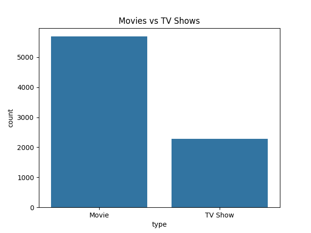
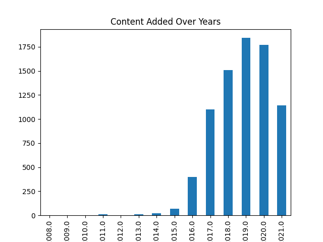
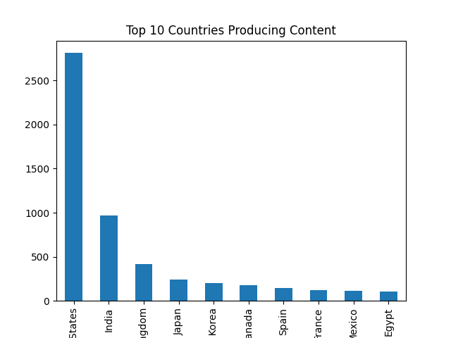

<h1 align="center">🎬 Netflix Data Analysis</h1>

<p align="center">
Exploratory Data Analysis (EDA) on Netflix dataset using Python 📊
</p>

---

## 📌 Project Overview

This project analyzes Netflix data to uncover trends in content, genres, and global distribution.

---

## 🛠️ Tools & Technologies

- Python  
- Pandas  
- Matplotlib  
- Seaborn  

---

## 📂 Dataset

- Source: Netflix Movies & TV Shows dataset  
- Contains:
  - Title  
  - Genre  
  - Country  
  - Release year  
  - Type (Movie/TV Show)  

---

## 📊 Key Analysis

- 📈 Content growth over years  
- 🎬 Movies vs TV Shows distribution  
- 🌍 Country-wise content production  

---

## 📷 Sample Output

  
  
  

---

## 💡 Key Insights

- 📈 Netflix content has grown significantly over recent years  
- 🎬 Movies dominate the platform compared to TV Shows  
- 🌍 The United States produces the most content  
- 📊 Major growth observed after 2015  

---

## 🧠 What I Learned

- Data cleaning is essential before analysis  
- Real-world data has missing values  
- Visualization helps understand patterns quickly  
- Pandas and Seaborn are powerful tools for analysis  

---

## 🚀 How to Run

```bash
pip install pandas matplotlib seaborn
python analysis.py
